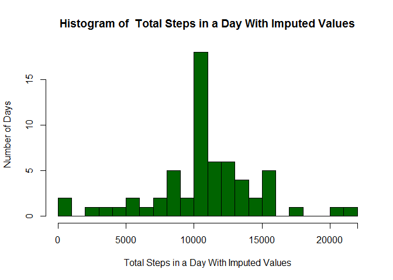
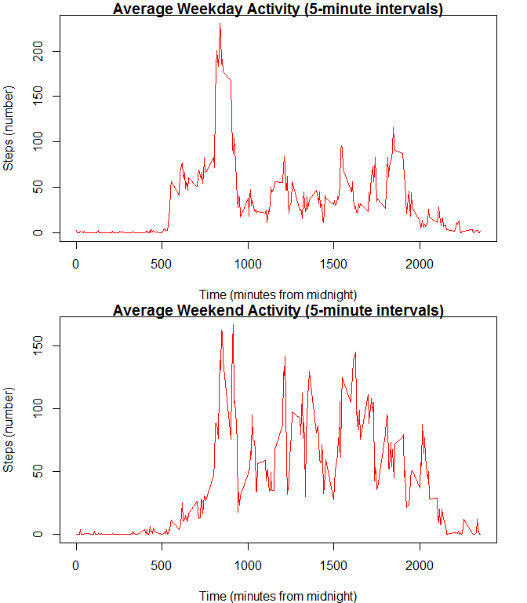

# Reproducible Research: Peer Assessment 1
David L. Anderson  
January 10, 2016  


## Loading and preprocessing the data

Load the data using `read.csv` into the **stepdata** dataframe. Also, convert the *date* data into a form that R will recognize as such.

```r
stepdata <- read.csv("activity.csv")

stepdata$date <- as.Date(stepdata$date)
```
Not strictly preprocessing, but I am going to use the `dplyr` library, so time to load it.


```r
library(dplyr)
```

```
## 
## Attaching package: 'dplyr'
```

```
## The following objects are masked from 'package:stats':
## 
##     filter, lag
```

```
## The following objects are masked from 'package:base':
## 
##     intersect, setdiff, setequal, union
```


## What is mean total number of steps taken per day?

Save the total number of steps per day in a new dataframe, **dailytotal**, which has *date* and *totalsteps* values.

```r
dailytotal <- stepdata %>%
    group_by(date) %>%
    summarise(totalsteps = sum(steps))
```

Let's look at a histogram of steps taken per day:

```r
histlabel <- "Total Steps in a Day"
hist(dailytotal$totalsteps,
     breaks = 20,
     col = "darkgreen",
     xlab = histlabel,
     ylab = "Number of Days",
     main = paste("Histogram of ", histlabel),
     #labels = TRUE,
     xaxt = "n")
axis(1, at= c(0,5000,10000,15000,20000,22000), pos = "y")
```

```
## Warning in axis(1, at = c(0, 5000, 10000, 15000, 20000, 22000), pos = "y"):
## NAs introduced by coercion
```

\


```r
dailymedian <- median(dailytotal$totalsteps, na.rm = TRUE)
```

```r
dailymean <- mean(dailytotal$totalsteps, na.rm = TRUE)
```
  
The **median** number of steps per day (ignoring NAs) is 10765.
  
The **mean** number of steps per day (ignoring NAs) is 1.0766189\times 10^{4}, which is pretty similar to the median.

## What is the average daily activity pattern?

That is, when are steps taken over the course of a day? We will find this by computing the average of each 5-minute period over all of the days, in a new dataframe named **intervalsteps**


```r
intervalsteps <- stepdata %>%
    group_by(interval) %>%
    summarise(averagesteps = mean(steps, na.rm = TRUE))
```
Then do a line plot over the course of a (mean) day of how many steps are taken.


```r
plot(intervalsteps$interval, intervalsteps$averagesteps,
     type = "l",
     col = "red",
     main = "Average Daily Activity (5-minute intervals)",
     ylab = "Steps (number)",
     xlab = "Time (minutes from midnight)")
```

\

Looks like this individual sleeps in the morning, and/or has the monitoring device off prior to waking up at about 5 am. They also tend to go for a brisk walk or perhaps jog in the morning.

To quantify this, find which 5-minute interval has the greatest average number of steps.


```r
maxsteps <- max(intervalsteps$averagesteps, na.rm = TRUE)
maxinterval <- intervalsteps$interval[intervalsteps$averagesteps == maxsteps]
```
Indeed, the interval with the greatest number of steps is at 835 which translates to the interval from 8:30 to 8:35 in the morning.

## Imputing missing values

However, by inspecting the **stepdata** dataframe, we notice that there are many intervals in which nothing was recorded. To quantify:


```r
totalintervals <- length(stepdata$steps)
whichstepsNA <- which(is.na(stepdata$steps)) #going to use this later
NAintervals <- length(whichstepsNA)
```
So of the 17568 intervals in the time period of measurement, we find that 2304 of them have NA recorded.

Therefore, we shall create a new dataframe, **stepdata2**, where any interval for which "NA" is recorded will be given the value of the average for that interval, computed previously.

For example, an interval labeled with "0" which has "NA" recorded will have this replaced by 1.7169811 (`intervalsteps$averagesteps[1]`).


```r
stepdata2 <- stepdata

for(i in whichstepsNA){
    thisinterval <- stepdata$interval[i]
    thisstepvalue <- intervalsteps$averagesteps[ intervalsteps$interval == thisinterval ]
    ##Sorry about the ugly line of code!
    stepdata2$steps[i] <- thisstepvalue
}
```

Save the total number of steps per day in a new dataframe, **dailytotal2**, which has *date* and *totalsteps* values.

```r
dailytotal2 <- stepdata2 %>%
    group_by(date) %>%
    summarise(totalsteps = sum(steps))
```

Let's look at a histogram of steps taken per day:

```r
histlabel2 <- "Total Steps in a Day With Imputed Values"
hist(dailytotal2$totalsteps,
     breaks = 20,
     col = "darkgreen",
     xlab = histlabel2,
     ylab = "Number of Days",
     main = paste("Histogram of ", histlabel2),
     #labels = TRUE,
     xaxt = "n")
axis(1, at= c(0,5000,10000,15000,20000,22000), pos = "y")
```

```
## Warning in axis(1, at = c(0, 5000, 10000, 15000, 20000, 22000), pos = "y"):
## NAs introduced by coercion
```

\


```r
dailymedian2 <- median(dailytotal2$totalsteps, na.rm = TRUE)
```

```r
dailymean2 <- mean(dailytotal2$totalsteps, na.rm = TRUE)
```
  
The **median** number of steps per day (replacing NAs) is 1.0766189\times 10^{4}.
  
The **mean** number of steps per day (replacing NAs) is 1.0766189\times 10^{4}, which is identical to the median. It would appear that when the owner of this monitoring device forgets it, it is for most of the day. Hence when we impute values, they simply are all on the mean, which thus becomes the median as well.

## Are there differences in activity patterns between weekdays and weekends?

To determine this, we first need to create a new factor variable (*partofweek*) in **stepdata2** labeling whether each date is a "weekday" or on the "weekend".


```r
## Get the days of the week.
stepdata2$partofweek <- weekdays(stepdata2$date)

## Create a couple of vectors for relabeling
weekdaydays <- c("Monday", "Tuesday", "Wednesday", "Thursday", "Friday")
weekenddays <- c("Saturday", "Sunday")

## Use these to convert all days to either "weekday" or "weekend"
stepdata2$partofweek[stepdata2$partofweek[1:length(stepdata2$partofweek)] %in% weekenddays] <- "weekend"
stepdata2$partofweek[stepdata2$partofweek[1:length(stepdata2$partofweek)] %in% weekdaydays] <- "weekday"

## make it a factor
stepdata2$partofweek <- as.factor(stepdata2$partofweek)
```

Now to see if the pattern varies by the part of the week. First group by the part of the week and the interval, then average the steps.


```r
intervalsteps2 <- stepdata2 %>%
    group_by(partofweek, interval) %>%
    summarise(averagesteps = mean(steps, na.rm = TRUE))

## Split into two new dataframes for graphing convenience.
intervalstepsend <- intervalsteps2[intervalsteps2$partofweek == "weekend",]
intervalstepsday <- intervalsteps2[intervalsteps2$partofweek == "weekday",]
```
Then do a line plot over the course of a (mean) day of how many steps are taken.


```r
par(mfrow = c(2,1), pty="m", pin = c(7, 1.5), mar = c(4,4,1,2))

plot(intervalstepsday$interval, intervalstepsday$averagesteps,
     type = "l",
     col = "red",
     main = "Average Weekday Activity (5-minute intervals)",
     ylab = "Steps (number)",
     xlab = "Time (minutes from midnight)")

plot(intervalstepsend$interval, intervalstepsend$averagesteps,
     type = "l",
     col = "red",
     main = "Average Weekend Activity (5-minute intervals)",
     ylab = "Steps (number)",
     xlab = "Time (minutes from midnight)")
```

\

It would appear that the individual who owns this monitoring device wakes up somewhat more leisurely on the weekends compared to weekdays, doesn't go for quite as brisk of a morning run, but maintains more motion over the course of a weekend day than a weekday.


